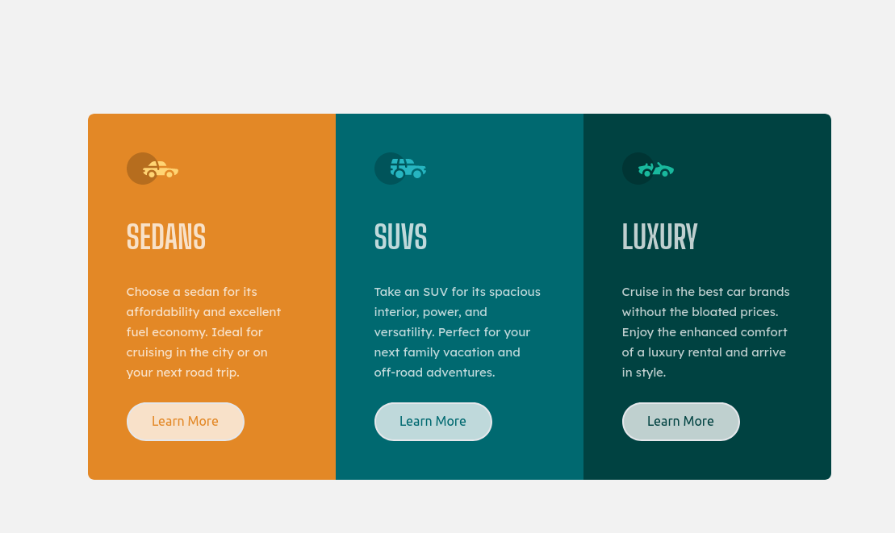

[[top]]
= Frontend Mentor - 3-column preview card component solution
:toc: preamble

link:../../../[Back]

== Overview
This is a solution to the link:https://www.frontendmentor.io/challenges/3column-preview-card-component-pH92eAR2-[3-column preview card component challenge on Frontend Mentor]. Frontend Mentor challenges help you improve your coding skills by building realistic projects. 

=== Screenshot

=== Links

* Solution URL: link:https://github.com/kwoitecki/frontendmentor-playground/tree/main/challenges/newbie/3-column-preview-card-component[GitHub Repository]
* Live Site URL: link:https://kwoitecki.github.io/frontendmentor-playground/challenges/newbie/3-column-preview-card-component/dist/[GitHub Pages]

== My process

=== Built with

* Semantic HTML5 markup
* Flexbox
* link:https://tailwindcss.com/docs/installation[Tailwind CSS Documentation]
* link:https://sass-lang.com/[Sass (Syntactically Awesome Stylesheets)]

=== Useful resources
* link:https://code.visualstudio.com/docs/devcontainers/containers[devcontainer]
* link:https://www.youtube.com/watch?v=9oqu9134U8Q[Vite - Modern JavaScript Bundler | Full Course]
* link:https://github.com/igorbabko/builds-with-vite/commit/63a930e6473c8238da411ac9b9dd2a44ce0d87e8[Simple Setup PostCSS with Tailwind CSS]
* link:https://tailwindcss.com/docs/guides/vite[Install Tailwind CSS with Vite]
* link:https://apps.kde.org/de/kruler/[KRuler]

