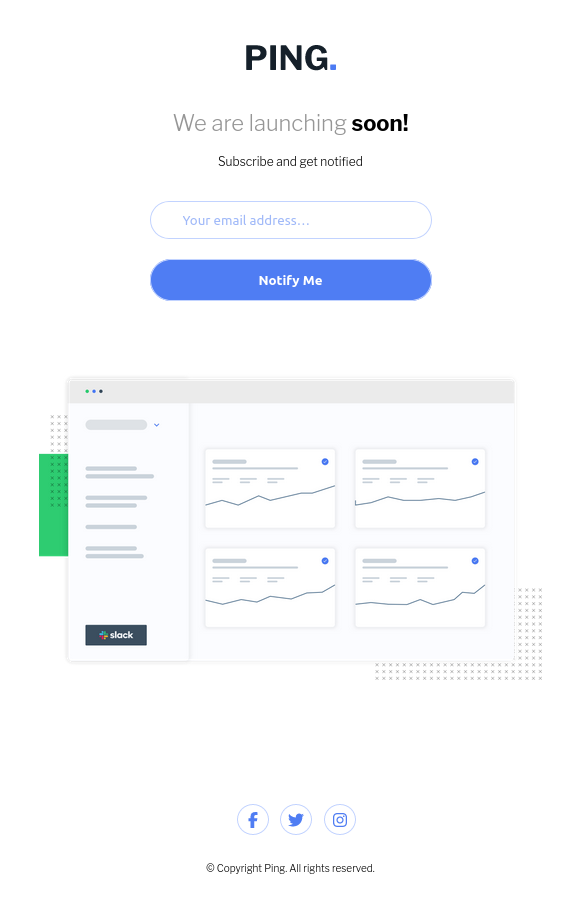

[[top]]
= Frontend Mentor - Ping coming soon page solution
:toc: preamble

link:../../../[Back]

== Overview
This is a solution to the link:https://www.frontendmentor.io/challenges/ping-single-column-coming-soon-page-5cadd051fec04111f7b848da[Ping coming soon page challenge on Frontend Mentor]. Frontend Mentor challenges help you improve your coding skills by building realistic projects. 

=== Screenshot

.Desktop
image:./images/desktop.png[Desktop]

.Mobile

=== Links

* Solution URL: link:https://github.com/kwoitecki/frontendmentor-playground/tree/main/challenges/newbie/ping-coming-soon-page[GitHub Repository]
* Live Site URL: link:https://kwoitecki.github.io/frontendmentor-playground/challenges/newbie/ping-coming-soon-page/dist/[GitHub Pages]

== My process

=== Built with
* Semantic HTML5 markup
* Flexbox
* link:https://sass-lang.com/documentation/[Sass]
* link:https://vitejs.dev/[Vite]
* colorZilla
* link:reactjs.org[React]

=== Useful resources
* link:https://code.visualstudio.com/docs/devcontainers/containers[devcontainer]
* link:https://dev.to/dostonnabotov/a-modern-sass-folder-structure-330f[Sass folder structure]
* link:https://github.com/dostonnabotov/sass-template[Sass template]