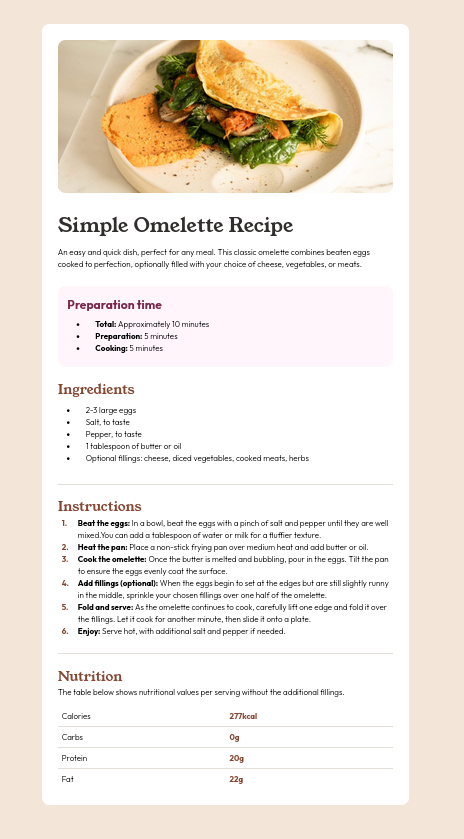

[[top]]
= Frontend Mentor - Recipe page solution
:toc: preamble

link:../../[Back]

== Overview
This is a solution to the [Recipe page challenge on Frontend Mentor](https://www.frontendmentor.io/challenges/recipe-page-KiTsR8QQKm). Frontend Mentor challenges help you improve your coding skills by building realistic projects.

=== Screenshot

=== Links

* Solution URL: link:https://github.com/kwoitecki/frontendmentor-playground/tree/main/challenges/newbie/recipe-page[GitHub Repository]
* Live Site URL: link:https://kwoitecki.github.io/frontendmentor-playground/challenges/newbie/recipe-page/dist/[GitHub Pages]

== My process

=== Built with

* Semantic HTML5 markup
* Flexbox
* link:https://sass-lang.com/[Sass (Syntactically Awesome Stylesheets)]

=== Useful resources

* link:https://code.visualstudio.com/docs/devcontainers/containers[devcontainer]
* link:https://www.w3schools.com/css/css3_flexbox.asp[Flexbox]
* link:https://apps.kde.org/de/kruler/[KRuler]
