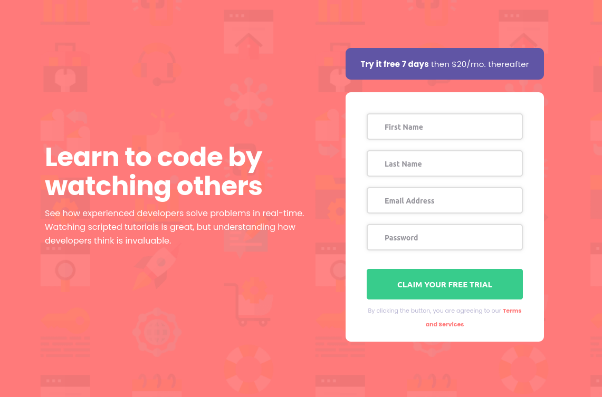

[[top]]
= Frontend Mentor - Intro component with sign up form solution
:toc: preamble

link:../../../[Back]

== Overview
This is a solution to the link:https://www.frontendmentor.io/challenges/intro-component-with-signup-form-5cf91bd49edda32581d28fd1[Intro component with sign up form challenge on Frontend Mentor]. Frontend Mentor challenges help you improve your coding skills by building realistic projects. 

=== Screenshot

.Desktop 1

.Desktop 2

.Mobile

=== Links

* Solution URL: link:https://github.com/kwoitecki/frontendmentor-playground/tree/main/challenges/newbie/sign-up-form-component[GitHub Repository]
* Live Site URL: link:https://kwoitecki.github.io/frontendmentor-playground/challenges/newbie/sign-up-form-component/dist/[GitHub Pages]

== My process

=== Built with

* Semantic HTML5 markup
* Flexbox
* link:https://sass-lang.com/documentation/[Sass]
* link:https://vitejs.dev/[Vite]
* link:reactjs.org[React]

=== Useful resources
* link:https://code.visualstudio.com/docs/devcontainers/containers[devcontainer]
* link:https://www.youtube.com/watch?v=9oqu9134U8Q[Vite - Modern JavaScript Bundler | Full Course]
* link:https://tailwindcss.com/docs/guides/vite[Install Tailwind CSS with Vite]

