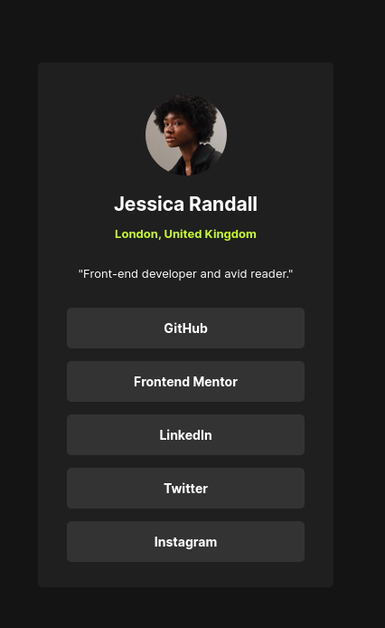

# Frontend Mentor - Social links profile solution

This is a solution to the [Social links profile challenge on Frontend Mentor](https://www.frontendmentor.io/challenges/social-links-profile-UG32l9m6dQ). Frontend Mentor challenges help you improve your coding skills by building realistic projects.

## Table of contents

- [Overview](#overview)
  - [The challenge](#the-challenge)
  - [Screenshot](#screenshot)
  - [Links](#links)
- [My process](#my-process)
  - [Built with](#built-with)
  - [Useful resources](#useful-resources)

## Overview

### The challenge

Users should be able to:

- See hover and focus states for all interactive elements on the page

### Screenshot

### Links

- Solution URL: [GitHub Repository](https://github.com/kwoitecki/frontendmentor-playground/tree/main/challenges/newbie/social-links-profile)
- Live Site URL: [GitHub Pages](https://kwoitecki.github.io/frontendmentor-playground/challenges/newbie/social-links-profile/dist/)

## My process

### Built with

- Semantic HTML5 markup
- Flexbox
- [Sass](https://sass-lang.com/) - Sass (Syntactically Awesome Stylesheets)

### Useful resources

- [devcontainer](https://code.visualstudio.com/docs/devcontainers/containers)
- [Flexbox](https://www.w3schools.com/css/css3_flexbox.asp)
- [KRuler](https://apps.kde.org/de/kruler/)
