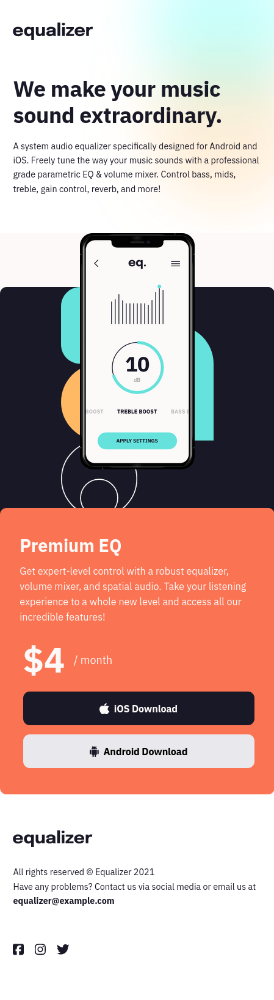
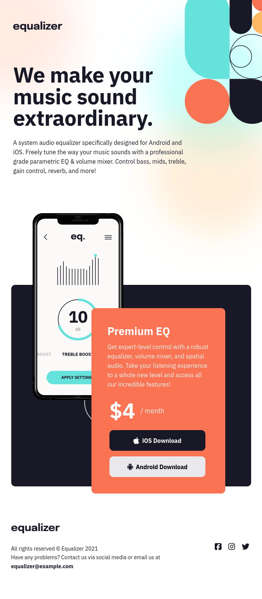
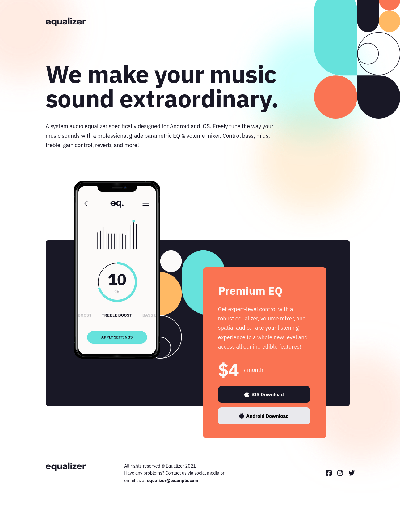

[[top]]
= Frontend Mentor - Equalizer landing page solution
:toc: preamble

link:../../[Back]

== Overview
This is a solution to the link:https://www.frontendmentor.io/challenges/equalizer-landing-page-7VJ4gp3DE[Equalizer landing page challenge on Frontend Mentor]. Frontend Mentor challenges help you improve your coding skills by building realistic projects. 

=== Screenshot

TODO
// .Mobile
// 

// .Tablet
// 

// .Desktop
// 

=== Links

* Solution URL: link:https://github.com/kwoitecki/frontendmentor-playground/tree/main/premium/equalizer-landing-page[GitHub Repository]
* Live Site URL: link:https://kwoitecki.github.io/frontendmentor-playground/premium/equalizer-landing-page/dist/[GitHub Pages]

== My process

=== Built with

* Semantic HTML5 markup
* Flexbox
* CSS Grid
* link:https://sass-lang.com/documentation/[Sass]
* colorZilla

=== Useful resources
* link:https://code.visualstudio.com/docs/devcontainers/containers[devcontainer]
* link:https://dev.to/dostonnabotov/a-modern-sass-folder-structure-330f[Sass folder structure]
* link:https://github.com/dostonnabotov/sass-template[Sass template]
* link:https://www.youtube.com/watch?v=h3bTwCqX4ns&list=PL4-IK0AVhVjNDRHoXGort7sDWcna8cGPA[Build a responsive website with HTML & CSS]